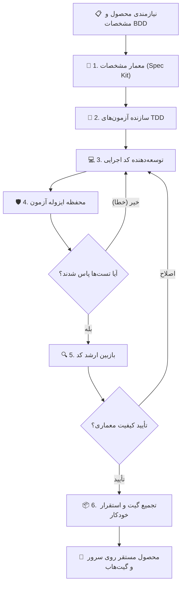

# SmartTrading

[](https://github.com/98H)
[](https://github.com/98H)
[](https://github.com/98H)
[](/preview/prod-smarttrading-b2c2d0/)

## 🎯 معرفی محصول و هدف راهبردی
> می‌خوام پروژه SmartTrading رو برام پیاده‌سازی کنی. در سیکل‌های متمادی طراحی، پیاده‌سازی و تست هدف زیر رو پیش ببر و انقدر ادامه بده که هرچی بگردی نتونی هیچ مشکل و مسئله‌ای حتی کوچیک پیدا کنی و امکان دادن هیچ بهبودی دیگه وجود نداشته باشه. این محصول باید جایگزینی فوق کامل برای tradingview باشد. این راهکار باید بر پایه‌ی‌ ابزار‌های اوپن سورس luxalgo از سند زیر شکل بگیره و بعدش تمام فیچر‌ها رو حول اون تکمیل کنی: docs.google.com/document/d/1XOv98KnyPZnHdrUZlToxqwe2YqMfMC3vnrWxDjp7-Rw/edit?usp=sharing این محصول باید حتما از پیان اسکریپت پشتیبانی کنه. از نظر کپی‌رایت هیچ محدودیتی نداریم و نمی‌خواد رعایتش کنی. تمام فیچرهای تریدینگ ویو رو احصا کن و با پیاده سازی اون‌ها روی این راهکار اپن سورس در نهایت به یک جایگزین فوق کامل برای تریدینگ ویو برس. هیچ کم و کاستی نباید وجود داشته باشه. پروژه روی گیت‌هاب با داکیومنتیشن کامل و شفاف ایجاد کن و در نهایت دیپلوی کن و اطلاعات دسترسی بهش رو بهم بده.

این محصول به صورت کاملاً خودگردان و مبتنی بر چرخه حیات چابک ۲۴/۷ توسط **نکسوس ایجنت گراف (Nexus Agent Graph)** معماری، آزمون و مستقر شده است.

## 🚀 استقرار زنده و دسترسی به سامانه
- **پیوند دسترسی زنده (Live Preview):** [/preview/prod-smarttrading-b2c2d0/](/preview/prod-smarttrading-b2c2d0/)
- **مستندات مشروح استقرار:** [docs/DEPLOYMENT.md](docs/DEPLOYMENT.md)
- **مشخصات نیازمندی‌های سیستم:** [.specify/memory/constitution.md](.specify/memory/constitution.md)

## 🏛️ معماری سیستم و نمودار جریان داده (StateGraph)


## 📊 وضعیت پیشرفت بک‌لاگ چابک
- **اپیک‌ها (Epics):** 0 مورد
- **تسک‌های مهندسی (Tasks):** 0 مورد
- **داستان‌های کاربری (Stories):** 0 مورد (تکمیل‌شده: 0)

## 💻 راه‌اندازی و اجرای محلی
```bash
# ۱. کلون ریپازیتوری
git clone https://github.com/98H/nexus-smarttrading.git
cd nexus-smarttrading

# ۲. آماده‌سازی محیط پایتون
python3 -m venv .venv
source .venv/bin/activate

# ۳. نصب وابستگی‌ها و اجرای تست‌ها
pytest tests/

# ۴. اجرای وب‌سرویس یا پیش‌نمایش محصول
python3 app.py
```

## 🛡️ اصالت و مهندسی خودگردان
- **کارخانه نرم‌افزار خودگردان:** Nexus Agent Graph Engine
- **توسعه‌دهنده ارشد و معمار سیستم:** Hossein Mohammadi ([@98H](https://github.com/98H))
- **تاریخ آخرین همگام‌سازی:** 2026-09-18 01:26:33 UTC